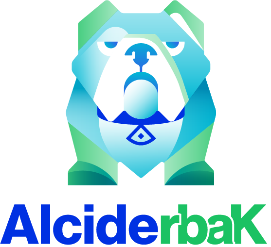

[![GitHub release][release-img]][release]

[](https://opensource.org/licenses/Apache-2.0)



# rbac-tool

A collection of Kubernetes RBAC tools that complement the Kubernetes native capabilities

- [Install](#install)
- [The `rbac-tool gen` command](#-rbac-tool-gen-)
   * [How the command works?](#how--rbac-tool--works-)
   * [Command Line Examples](#command-line-examples)
   * [Example Output](#example-output)
- [Command Line Reference](#command-line-reference)
- [Contributing](#contributing)

## Install

Download the latest from the [release](https://github.com/alcideio/rbac-tool/releases) page

Build from Source (*go 1.13*):

```shell script
go get -u github.com/alcideio/rbac-tool
cd $(GOPATH)/src/github.com/alcideio/rbac-tool
make get-deps build
```

## Kubernetes RBAC

Role-based access control (RBAC) is a method of regulating access to computer or network resources based on the roles of individual users within your organization.
RBAC authorization uses the `rbac.authorization.k8s.io` API group to drive authorization decisions, allowing you to dynamically configure policies through the Kubernetes API.

Permissions are purely **additive** (there are **no “deny”** rules).

A Role always sets permissions within a particular namespace ; when you create a Role, you have to specify the namespace it belongs in.
ClusterRole, by contrast, is a non-namespaced resource.
ClusterRoles have several uses. You can use a ClusterRole to:

- define permissions on namespaced resources and be granted within individual namespace(s)
- define permissions on namespaced resources and be granted across all namespaces
- define permissions on cluster-scoped resources

If you want to define a role within a namespace, use a Role; if you want to define a role cluster-wide, use a ClusterRole.

**rbac-tool** simplifies the creation process of RBAC policies and avoiding those wildcards `*` and it adapts to specific Kubernets API server


# `rbac-tool gen`

Examples would be simplest way to describe how `rbac-tool gen` can help:
*  Generate a `ClusterRole` policy that allows to read everything **except** *secrets* and *services*
*  Generate a `Role` policy that allows create,update,get,list  (read/write) everything **except** *secrets*, *services*, *ingresses*, *networkpolicies*
*  Generate a `Role` policy that allows create,update,get,list  (read/write) everything **except** *statefulsets*

`rbac-tool` generate RBAC `Role` or RBAC `ClusterRole` resource while reducing the use of wildcards, and support **deny** semantics for specific Kubernetes clusters.

### How `rbac-tool` works?

`rbac-tool` reads from the Kubernetes discovery API the available API Groups and resources, 
and based on the command line options, generate an explicit Role/ClusterRole that avoid wildcards.


###  Command Line Examples

Examples generated against Kubernetes cluster v1.16 deployed using KIND. 

> Generate a `ClusterRole` policy that allows to read everything **except** *secrets* and *services*
```bash
rbac-tool  gen  --deny-resources=secrets.,services. --allowed-verbs=get,list
```

>  Generate a `Role` policy that allows create,update,get,list (read/write) everything **except** *secrets*, *services*, *networkpolicies* in *core*,*apps* & *networking.k8s.io* API groups
```bash
rbac-tool  gen --generated-type=Role --deny-resources=secrets.,services.,networkpolicies.networking.k8s.io --allowed-verbs=* --allowed-groups=,extensions,apps,networking.k8s.io
```

> Generate a `Role` policy that allows create,update,get,list  (read/write) everything **except** *statefulsets*
```bash
rbac-tool  gen --generated-type=Role --deny-resources=apps.statefulsets --allowed-verbs=* 
```


### Example Output

>  Generate a `Role` policy that allows create,update,get,list (read/write) everything **except** *secrets*, *services*, *networkpolicies* in *core*,*apps* & *networking.k8s.io* API groups
```bash
rbac-tool  gen --generated-type=Role --deny-resources=secrets.,services.,networkpolicies.networking.k8s.io --allowed-verbs=* --allowed-groups=,extensions,apps,networking.k8s.io
```

```yaml
apiVersion: rbac.authorization.k8s.io/v1
kind: Role
metadata:
  creationTimestamp: null
  name: custom-role
  namespace: mynamespace
rules:
- apiGroups:
  - ""
  resources:
  - events
  - componentstatuses
  - podtemplates
  - namespaces
  - replicationcontrollers
  - persistentvolumes
  - configmaps
  - persistentvolumeclaims
  - resourcequotas
  - limitranges
  - nodes
  - bindings
  - serviceaccounts
  - pods
  - endpoints
  verbs:
  - '*'
- apiGroups:
  - extensions
  resources:
  - ingresses
  verbs:
  - '*'
- apiGroups:
  - apps
  resources:
  - replicasets
  - daemonsets
  - deployments
  - controllerrevisions
  - statefulsets
  verbs:
  - '*'
- apiGroups:
  - networking.k8s.io
  resources:
  - ingresses
  verbs:
  - '*'
```

## Command Line Reference

```bash
Generate Role or ClusterRole resource while reducing the use of wildcards.

rbac-tool read from the Kubernetes discovery API the available API Groups and resources, 
and based on the command line options, generate an explicit Role/ClusterRole that avoid wildcards

Examples:

# Generate a Role with read-only (get,list) excluding secrets (core group) and ingresses (extensions group) 
rbac-tool gen --generated-type=Role --deny-resources=secrets.,ingresses.extensions --allowed-verbs=get,list

# Generate a Role with read-only (get,list) excluding secrets (core group) from core group, admissionregistration.k8s.io,storage.k8s.io,networking.k8s.io
rbac-tool gen --generated-type=ClusterRole --deny-resources=secrets., --allowed-verbs=get,list  --allowed-groups=,admissionregistration.k8s.io,storage.k8s.io,networking.k8s.io

Usage:
  rbac-tool generate [flags]

Aliases:
  generate, gen

Flags:
      --allowed-groups strings   Comma separated list of API groups we would like to allow '*' (default [*])
      --allowed-verbs strings    Comma separated list of verbs to include. To include all use '* (default [*])
  -c, --cluster-context string   Cluster.use 'kubectl config get-contexts' to list available contexts
      --deny-resources strings   Comma separated list of resource.group
  -t, --generated-type string    Role or ClusteRole (default "ClusterRole")
  -h, --help                     help for generate
```

## Contributing

### Bugs

If you think you have found a bug please follow the instructions below.

- Please spend a small amount of time giving due diligence to the issue tracker. Your issue might be a duplicate.
- Open a [new issue](https://github.com/alcideio/rbac-tool/issues/new) if a duplicate doesn't already exist.

### Features

If you have an idea to enhance rbac-tool follow the steps below.

- Open a [new issue](https://github.com/alcideio/rbac-tool/issues/new).
- Remember users might be searching for your issue in the future, so please give it a meaningful title to helps others.
- Clearly define the use case, using concrete examples.
- Feel free to include any technical design for your feature.

### Pull Requests

- Your PR is more likely to be accepted if it focuses on just one change.
- Please include a comment with the results before and after your change. 
- Your PR is more likely to be accepted if it includes tests. 
- You're welcome to submit a draft PR if you would like early feedback on an idea or an approach. 
