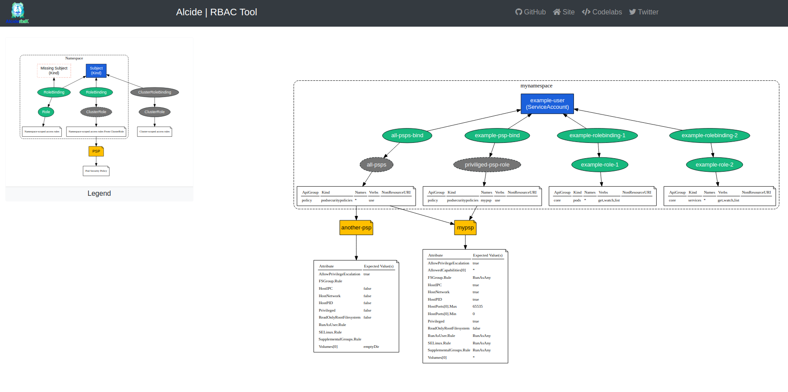

[](https://github.com/alcideio/rbac-tool/actions/workflows/build.yml)
[](https://opensource.org/licenses/Apache-2.0)


##  | insightCloudSec | RBAC Tool For Kubernetes

## Kubernetes RBAC

Role-based access control (RBAC) is a method of regulating access to computer or network resources based on the roles of individual users within your organization.
RBAC authorization uses the `rbac.authorization.k8s.io` API group to drive authorization decisions, allowing you to dynamically configure policies through the Kubernetes API.

Permissions are purely **additive** (there are **no “deny”** rules).

A Role always sets permissions within a particular namespace ; when you create a Role, you have to specify the namespace it belongs in.
ClusterRole, by contrast, is a non-namespaced resource.
ClusterRoles have several uses. You can use a ClusterRole to:

- define permissions on namespaced resources and be granted within individual namespace(s)
- define permissions on namespaced resources and be granted across all namespaces
- define permissions on cluster-scoped resources

If you want to define a role within a namespace, use a Role; if you want to define a role cluster-wide, use a ClusterRole.

**rbac-tool** simplifies querying and creation RBAC policies.

## Install

#### Standalone
Download the latest from the [release](https://github.com/alcideio/rbac-tool/releases) page

```shell script
curl https://raw.githubusercontent.com/alcideio/rbac-tool/master/download.sh | bash
```

#### kubectl plugin //   

```shell script
$ kubectl krew install rbac-tool
```

# rbac-tool

A collection of Kubernetes RBAC tools to sugar coat Kubernetes RBAC complexity

```shell script
rbac-tool

Usage:
  rbac-tool [command]

Available Commands:
  analysis        Analyze RBAC permissions and highlight overly permissive principals, risky permissions, etc.
  auditgen        Generate RBAC policy from Kubernetes audit events
  bash-completion Generate bash completion. source <(rbac-tool bash-completion)
  generate        Generate Role or ClusterRole and reduce the use of wildcards
  help            Help about any command
  lookup          RBAC Lookup by subject (user/group/serviceaccount) name
  policy-rules    RBAC List Policy Rules For subject (user/group/serviceaccount) name
  show            Generate ClusterRole with all available permissions from the target cluster
  version         Print rbac-tool version
  visualize       A RBAC visualizer
  who-can         Shows which subjects have RBAC permissions to perform an action
  whoami          Shows the subject for the current context with which one authenticates with the cluster
  
Flags:
  -h, --help      help for rbac-tool
  -v, --v Level   number for the log level verbosity

Use "rbac-tool [command] --help" for more information about a command.
```

- [The `rbac-tool viz` command](#rbac-tool-viz)
- [The `rbac-tool analysis` command](#rbac-tool-analysis)
- [The `rbac-tool lookup` command](#rbac-tool-lookup)
- [The `rbac-tool who-can` command](#rbac-tool-who-can)
- [The `rbac-tool policy-rules` command](#rbac-tool-policy-rules)
- [The `rbac-tool auditgen` command](#rbac-tool-auditgen)
- [The `rbac-tool gen` command](#rbac-tool-gen)
- [The `rbac-tool show` command](#rbac-tool-show)
- [The `rbac-tool whoami` command](#rbac-tool-whoami)
- [Command Line Reference](#command-line-reference)
- [Contributing](#contributing)


# `rbac-tool viz`

A Kubernetes RBAC visualizer that generate a graph as dot file format or in HTML format.



By default 'rbac-tool viz' will connect to the local cluster (pointed by kubeconfig)
Create a RBAC graph of the actively running workload on all namespaces except kube-system

See run options on how to render specific namespaces, other clusters, etc.

```shell script
#Render Locally
rbac-tool viz --outformat dot && cat rbac.dot | dot -Tpng > rbac.png  && open rbac.png

# Render Online
https://dreampuf.github.io/GraphvizOnline
```

Examples:

```shell script
# Scan the cluster pointed by the kubeconfig context 'myctx'
rbac-tool viz --cluster-context myctx
```

```shell script
# Scan and create a PNG image from the graph
rbac-tool viz --outformat dot --exclude-namespaces=soemns && cat rbac.dot | dot -Tpng > rbac.png && google-chrome rbac.png
```


# `rbac-tool show`

Generate sample ClusterRole with all available permissions from the target cluster.

rbac-tool read from the Kubernetes discovery API the available API Groups and resources,
and based on the command line options, generate an explicit ClusterRole with available resource permissions.
Examples:

```shell script
# Generate a ClusterRole with all the available permissions for core and apps api groups
rbac-tool show  --for-groups=,apps
```


# `rbac-tool analysis`

Analyze RBAC permissions and highlight overly permissive principals, risky permissions.
The command allows to use a custom analysis rule set, as well as the ability to define custom exceptions (global and per-rule).

The default rule set can be found [here](pkg/analysis/default-rules.yaml)

Examples:

```shell script
# Analyze the cluster pointed by the kubeconfig context 'myctx' with the internal analysis rule set
rbac-tool analysis --cluster-context myctx
```

```shell script
# Analyze the cluster pointed by kubeconfig with the the provided analysis rule set
rbac-tool analysis --config myruleset.yaml
```


# `rbac-tool lookup`
Lookup of the Roles/ClusterRoles used attached to User/ServiceAccount/Group with or without [regex](https://regex101.com/)


Examples:

```shell script
# Search All Service Accounts
rbac-tool lookup
```

```shell script
# Search Service Accounts that match myname exactly
rbac-tool lookup myname
```

```shell script
# Search All Service Accounts that contain myname
rbac-tool lookup -e '.*myname.*'
```

```shell script
# Lookup System Accounts (all accounts that start with system: )
rbac-tool lookup -e '^system:'
  SUBJECT                                         | SUBJECT TYPE | SCOPE       | NAMESPACE   | ROLE                                                                 | BINDING
+-------------------------------------------------+--------------+-------------+-------------+----------------------------------------------------------------------+---------------------------------------------------+
  system:anonymous                                | User         | Role        | kube-public | kubeadm:bootstrap-signer-clusterinfo                                 | kubeadm:bootstrap-signer-clusterinfo
  system:authenticated                            | Group        | ClusterRole |             | system:basic-user                                                    | system:basic-user
  system:authenticated                            | Group        | ClusterRole |             | system:public-info-viewer                                            | system:public-info-viewer
  system:authenticated                            | Group        | ClusterRole |             | system:discovery                                                     | system:discovery
  system:bootstrappers:kubeadm:default-node-token | Group        | ClusterRole |             | kubeadm:get-nodes                                                    | kubeadm:get-nodes
  system:bootstrappers:kubeadm:default-node-token | Group        | ClusterRole |             | system:node-bootstrapper                                             | kubeadm:kubelet-bootstrap
  system:bootstrappers:kubeadm:default-node-token | Group        | ClusterRole |             | system:certificates.k8s.io:certificatesigningrequests:nodeclient     | kubeadm:node-autoapprove-bootstrap
  system:bootstrappers:kubeadm:default-node-token | Group        | Role        | kube-system | kube-proxy                                                           | kube-proxy
  system:bootstrappers:kubeadm:default-node-token | Group        | Role        | kube-system | kubeadm:nodes-kubeadm-config                                         | kubeadm:nodes-kubeadm-config
  system:bootstrappers:kubeadm:default-node-token | Group        | Role        | kube-system | kubeadm:kubelet-config                                               | kubeadm:kubelet-config
  system:kube-controller-manager                  | User         | ClusterRole |             | system:kube-controller-manager                                       | system:kube-controller-manager
...
```

# `rbac-tool who-can`

Shows which subjects have RBAC permissions to perform an action denoted by VERB on an object denoted as ( KIND | KIND/NAME | NON-RESOURCE-URL)

* VERB is a logical Kubernetes API verb like 'get', 'list', 'watch', 'delete', etc.
* KIND is a Kubernetes resource kind. Shortcuts and API groups will be resolved, e.g. 'po' or 'deploy'.
* NAME is the name of a particular Kubernetes resource.
* NON-RESOURCE-URL is a partial URL that starts with "/".

Examples:

```shell script
# Who can read ConfigMap resources
rbac-tool who-can get cm

# Who can watch Deployments
rbac-tool who-can watch deployments.apps

# Who can read the Kubernetes API endpoint /apis
rbac-tool who-can get /apis

# Who can read a secret resource by the name some-secret
rbac-tool who-can get secret/some-secret
```

# `rbac-tool policy-rules`
List Kubernetes RBAC policy rules for a given User/ServiceAccount/Group with or without [regex](https://regex101.com/)


Examples:

```shell script
# List policy rules for system unauthenicated group
rbac-tool policy-rules -e '^system:unauth'
```

Output:

```shell script
  TYPE  | SUBJECT                | VERBS | NAMESPACE | API GROUP | KIND | NAMES | NONRESOURCEURI                              
+-------+------------------------+-------+-----------+-----------+------+-------+--------------------------------------------+
  Group | system:unauthenticated | get   | *         | -         | -    | -     | /healthz,/livez,/readyz,/version,/version/  

```

> Leveraging JMESPath to filter and transform RBAC Policy rules.
>
>  For example: *Who Can Read Secrets*
>```shell script
> rbac-tool policy-rules -o json  | jp "[? @.allowedTo[? (verb=='get' || verb=='*') && (apiGroup=='core' || apiGroup=='*') && (resource=='secrets' || resource == '*')  ]].{name: name, namespace: namespace, kind: kind}"
>```
>
> See [https://jmespath.org/](https://jmespath.org/)
>

# `rbac-tool auditgen`

Generate RBAC policy from Kubernetes audit events.
Audit source format can be:
- Kubernetes List Object that contains Audit Events
- Newline seperated Audit Event objects
Audit source can be file, directory or http URL.

```shell script
rbac-tool auditgen -f audit.log
```

> This command is based on [this](https://github.com/liggitt/audit2rbac) prior work.

# `rbac-tool gen`

Examples would be simplest way to describe how `rbac-tool gen` can help:
*  Generate a `ClusterRole` policy that allows to read everything **except** *secrets* and *services*
*  Generate a `Role` policy that allows create,update,get,list  (read/write) everything **except** *secrets*, *services*, *ingresses*, *networkpolicies*
*  Generate a `Role` policy that allows create,update,get,list  (read/write) everything **except** *statefulsets*

`rbac-tool` generate RBAC `Role` or RBAC `ClusterRole` resource while reducing the use of wildcards, and support **deny** semantics for specific Kubernetes clusters.

# `rbac-tool whoami`

Shows the subject for the current context with which one authenticates with the cluster.

Examples:

```shell script
rbac-tool whoami --cluster-context myctx
```

### How `rbac-tool gen` works?

`rbac-tool` reads from the Kubernetes discovery API the available API Groups and resources, which represents the "world" of resources.
Based on the command line options, generate an explicit Role/ClusterRole that avoid wildcards by expanding wildcards to the available "world" resources.

###  Command Line Examples

Examples generated against Kubernetes cluster v1.16 deployed using KIND. 

> Generate a `ClusterRole` policy that allows to read everything **except** *secrets* and *services*
```bash
rbac-tool  gen  --deny-resources=secrets.,services. --allowed-verbs=get,list
```

>  Generate a `Role` policy that allows create,update,get,list (read/write) everything **except** *secrets*, *services*, *networkpolicies* in *core*,*apps* & *networking.k8s.io* API groups
```bash
rbac-tool  gen --generated-type=Role --deny-resources=secrets.,services.,networkpolicies.networking.k8s.io --allowed-verbs=* --allowed-groups=,extensions,apps,networking.k8s.io
```

> Generate a `Role` policy that allows create,update,get,list  (read/write) everything **except** *statefulsets*
```bash
rbac-tool  gen --generated-type=Role --deny-resources=apps.statefulsets --allowed-verbs=* 
```


### Example Output

>  Generate a `Role` policy that allows create,update,get,list (read/write) everything **except** *secrets*, *services*, *networkpolicies* in *core*,*apps* & *networking.k8s.io* API groups
```bash
rbac-tool  gen --generated-type=Role --deny-resources=secrets.,services.,networkpolicies.networking.k8s.io --allowed-verbs=* --allowed-groups=,extensions,apps,networking.k8s.io
```

```yaml
apiVersion: rbac.authorization.k8s.io/v1
kind: Role
metadata:
  creationTimestamp: null
  name: custom-role
  namespace: mynamespace
rules:
- apiGroups:
  - ""
  resources:
  - events
  - componentstatuses
  - podtemplates
  - namespaces
  - replicationcontrollers
  - persistentvolumes
  - configmaps
  - persistentvolumeclaims
  - resourcequotas
  - limitranges
  - nodes
  - bindings
  - serviceaccounts
  - pods
  - endpoints
  verbs:
  - '*'
- apiGroups:
  - extensions
  resources:
  - ingresses
  verbs:
  - '*'
- apiGroups:
  - apps
  resources:
  - replicasets
  - daemonsets
  - deployments
  - controllerrevisions
  - statefulsets
  verbs:
  - '*'
- apiGroups:
  - networking.k8s.io
  resources:
  - ingresses
  verbs:
  - '*'
```

## Command Line Reference

```bash
Generate Role or ClusterRole resource while reducing the use of wildcards.

rbac-tool read from the Kubernetes discovery API the available API Groups and resources, 
and based on the command line options, generate an explicit Role/ClusterRole that avoid wildcards

Examples:

# Generate a Role with read-only (get,list) excluding secrets (core group) and ingresses (extensions group) 
rbac-tool gen --generated-type=Role --deny-resources=secrets.,ingresses.extensions --allowed-verbs=get,list

# Generate a Role with read-only (get,list) excluding secrets (core group) from core group, admissionregistration.k8s.io,storage.k8s.io,networking.k8s.io
rbac-tool gen --generated-type=ClusterRole --deny-resources=secrets., --allowed-verbs=get,list  --allowed-groups=,admissionregistration.k8s.io,storage.k8s.io,networking.k8s.io

Usage:
  rbac-tool generate [flags]

Aliases:
  generate, gen

Flags:
      --allowed-groups strings   Comma separated list of API groups we would like to allow '*' (default [*])
      --allowed-verbs strings    Comma separated list of verbs to include. To include all use '* (default [*])
  -c, --cluster-context string   Cluster.use 'kubectl config get-contexts' to list available contexts
      --deny-resources strings   Comma separated list of resource.group
  -t, --generated-type string    Role or ClusteRole (default "ClusterRole")
  -h, --help                     help for generate
```

## Contributing

### Bugs

If you think you have found a bug please follow the instructions below.

- Please spend a small amount of time giving due diligence to the issue tracker. Your issue might be a duplicate.
- Open a [new issue](https://github.com/alcideio/rbac-tool/issues/new) if a duplicate doesn't already exist.

### Features

If you have an idea to enhance rbac-tool follow the steps below.

- Open a [new issue](https://github.com/alcideio/rbac-tool/issues/new).
- Remember users might be searching for your issue in the future, so please give it a meaningful title to helps others.
- Clearly define the use case, using concrete examples.
- Feel free to include any technical design for your feature.

### Pull Requests

- Your PR is more likely to be accepted if it focuses on just one change.
- Please include a comment with the results before and after your change. 
- Your PR is more likely to be accepted if it includes tests. 
- You're welcome to submit a draft PR if you would like early feedback on an idea or an approach.


[](https://starchart.cc/alcideio/rbac-tool)
